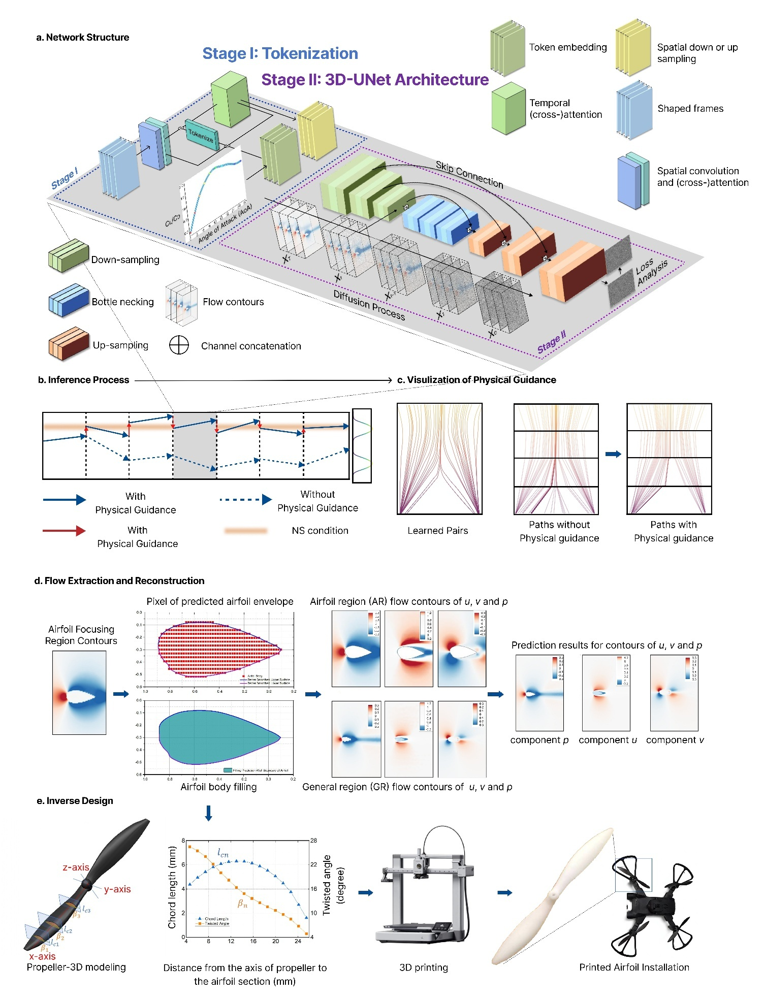

<h2 align="center"> 
  <!-- <a href="https://arxiv.org/abs/2411.10504"> -->
  Accelerating High-fidelity Airfoil Design via Physics-informed Video Diffusion Model
</h2>
<h5 align="center"> 
Yifeng Ai*, Yijia Guo*, Hongfu Zhang✉, Lei Zhou✉, Tiejun Huang, Weiqiu Chen, Xuhui He, Peng Guo, C.W.Lim✉, Lei Ma✉
 </h5>
<h5 align="center"> 
* Equal contributions,
✉ Corresponding authors </a>
</h5>
<!-- <h5 align="center">

<!-- [](https://arxiv.org/abs/2411.10504)
[](https://github.com/chenkang455/USP-Gaussian)
[](https://github.com/chenkang455/USP-Gaussian/stargazers)&#160; 

</h5> -->
## 👀 Overview
<p align="center">
  
</p>


## 📕 Abstract
>Airfoil design remains a challenging multi-objective optimization problem requiring precise geometric control for optimal aerodynamic performance. Data-driven inverse design methods mitigate this complexity but often yield non-physical results when physical constraints are not explicitly incorporated. Here, we construct a high-fidelity NACA–Nek1000 dataset with 53,400 samples from direct numerical simulations to train a dual physics-informed video diffusion model (PVDM). The governing equations of incompressible flow are intrinsically coupled with the diffusion learning process, enabling the reconstruction of full-field velocity and pressure distributions from lift-to-drag response sequences. The PVDM achieves accurate low–Reynolds number airfoil reconstruction and real-time flow generation within 30 seconds per case, approximately 600 times faster than conventional simulations, while maintaining over 90% fidelity. The reconstructed airfoils are further modeled as propeller geometries and experimentally validated which well fit the simulated lift-to-drag responses, establishing a rapid and generalizable framework for high-fidelity, physics-informed inverse aerodynamic design.


<!-- ## 👀 Visual Comparisons
<details open>
<summary><strong>Novel-view synthesis comparison on the real-world dataset.</strong></summary>
<p align="center">


</p>
</details>

<details open>
<summary><strong>Jointly optimized 3DGS and Recon-Net reconstruction on the synthetic dataset.</strong></summary>
<p align="center">

</p>
</details> -->


## 🗓️ TODO
- [x] Release the training code.
- [x] Release the dataset.
- [x] Release the pretrained model.
- [ ] Release the data generation code.
- [ ] Release the project page.


## 🕶 Get Started
### 1. Installation
## install torch
```
pip install --upgrade pip setuptools
pip install "torch==2.1.2+cu118" "torchvision==0.16.2+cu118" --extra-index-url https://download.pytorch.org/whl/cu118
conda install -c "nvidia/label/cuda-11.8.0" cuda-toolkit
```
## install dependencies
```
conda env create -f environment.yml
```

### 2. Dataset Preparation
Well-organized datasets can be found in the [download link](https://huggingface.co/datasets/diff-flow/diff-flow).

Overall, the structure of our project is formulated as:
```
<project root>
├── data
│   ├── fluid
|   |     ├──p_npy
|   |     ├──u_npy
|   |     ├──v_npy
|   |     └──Token.csv
│   └── target_response.csv
└── main.py
``` 

### 3. Pretrained Model
Pretrained model can be found in the [download link](https://huggingface.co/diff-flow/diff-flow).
Pretrained model should be formulated as:
```
<project root>
├── runs
│   └──Pretrained
|         └──model
|             ├──model.yaml
|             └──step_100000
|                     └──checkpoint.pt
└── main.py
``` 
<!-- For a comprehensive guide on synthesizing the entire synthetic dataset from scratch, as well as the pose estimation method, please refer to the [Dataset](scripts/Dataset.md) file.  -->

### 3. Training
```
accelerate launch main.py --name <you_name> --mode train
```


### 4. Rendering
For rendering 3D scene from the input camera trajectory, run:
```
accelerate launch main_our_npy.py --name pretrained --mode eval
```

## 🙇‍ Acknowledgment
Our code is implemented based on the [Inverse design of nonlinear mechanical metamaterials via video denoising diffusion models](https://www.nature.com/articles/s42256-023-00762-x) by [Jan-Hendrik Bastek](https://github.com/jhbastek/VideoMetamaterials) and the video denoising diffusion implementation by [Phil Wang](https://github.com/lucidrains/imagen-pytorch) proposed in [Imagen Video](https://imagen.research.google/video/).

## 🤝 Citation
If you find our work useful in your research, please cite:
```

```
